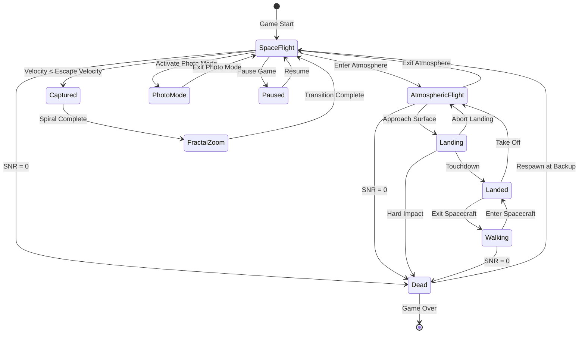
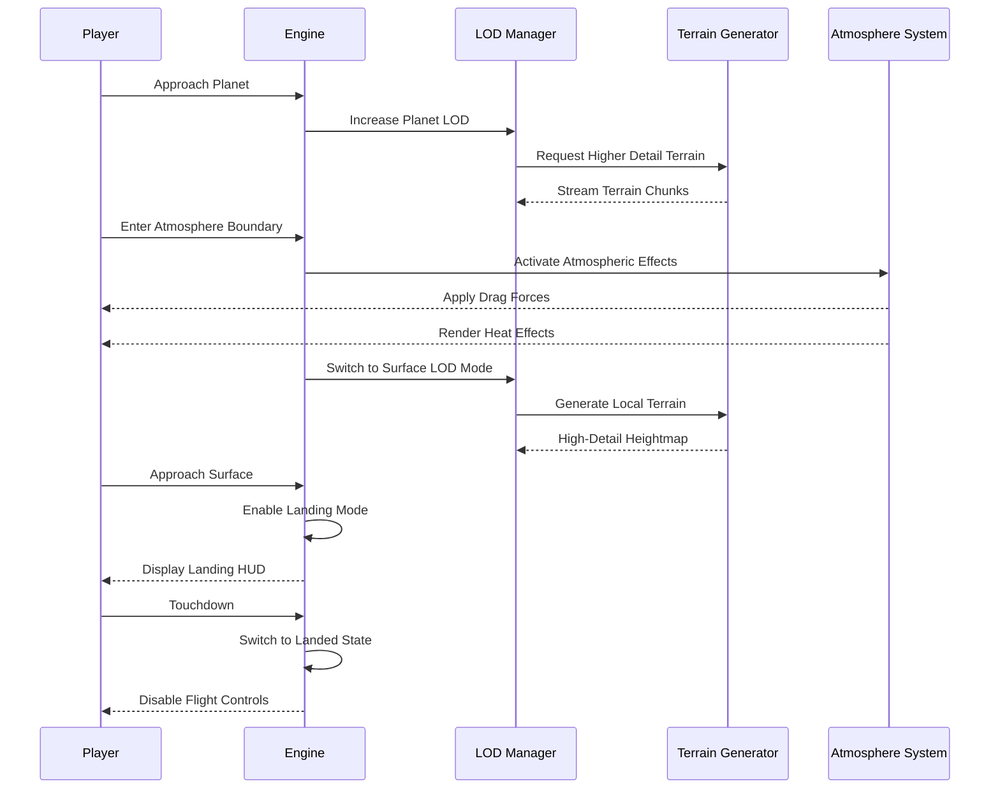

# Design Document

## Overview

Project Resonance is a high-fidelity VR space simulation that models the universe as a fractal harmonic lattice of standing waves. The system combines cutting-edge graphics technology (ray tracing, DLSS 3, volumetric rendering) with scientifically accurate orbital mechanics and relativistic physics. Players experience space travel as digital consciousness entities navigating a computational universe, with seamless transitions from interstellar space to planetary surfaces.

The architecture is built on Godot Engine 4.2+ with GDScript, targeting high-end hardware (RTX 4090 + i9-13900K) to achieve photorealistic visuals while maintaining 90 FPS in VR. The design emphasizes modularity, allowing independent development of physics, rendering, and gameplay systems.

## Architecture

### Player State Machine

The player transitions between distinct states during gameplay:



### Space-to-Surface Transition Sequence



### Memory Budget (RTX 4090 - 24GB VRAM)

| Category            | Budget    | Notes                                  |
| ------------------- | --------- | -------------------------------------- |
| Terrain Textures    | 8 GB      | 4K PBR texture sets, displacement maps |
| Star Catalog        | 2 GB      | Hipparcos/Gaia stellar data            |
| Spacecraft Models   | 1 GB      | Cockpit, exterior, LOD variants        |
| Lattice Rendering   | 2 GB      | Grid geometry, shader buffers          |
| Ray Tracing Buffers | 4 GB      | BVH structures, reflection buffers     |
| Post-Processing     | 2 GB      | Glitch effects, volumetrics            |
| Audio Buffers       | 1 GB      | HRTF data, sound samples               |
| System Reserve      | 4 GB      | OS, driver overhead, headroom          |
| **Total**           | **24 GB** |                                        |

### System Architecture

The simulation follows a layered architecture pattern:

```
┌─────────────────────────────────────────────────────────────┐
│                     VR Presentation Layer                    │
│  (OpenXR, HMD Tracking, Motion Controllers, Spatial Audio)   │
└──────────────────────┬──────────────────────────────────────┘
                       │
┌──────────────────────┴──────────────────────────────────────┐
│                    Game Logic Layer                          │
│  (Player State, Objectives, Progression, Save/Load)          │
└──────────────────────┬──────────────────────────────────────┘
                       │
┌──────────────────────┴──────────────────────────────────────┐
│                  Simulation Core Layer                       │
│  (Physics, Relativity, Orbital Mechanics, Time Management)   │
└──────────────────────┬──────────────────────────────────────┘
                       │
┌──────────────────────┴──────────────────────────────────────┐
│                   Rendering Layer                            │
│  (Godot Engine, Ray Tracing, Shaders, LOD, Procedural Gen)  │
└──────────────────────┬──────────────────────────────────────┘
                       │
┌──────────────────────┴──────────────────────────────────────┐
│                    Data Layer                                │
│  (Ephemeris Data, Procedural Seeds, Save Files, Config)     │
└─────────────────────────────────────────────────────────────┘
```

### Module Structure

```
/SpaceTime (Godot Project)
├── project.godot                    # Godot project configuration
├── main.tscn                        # Main scene
│
├── scripts/core/                    # Core simulation systems (GDScript)
│   ├── engine.gd                    # Main engine coordinator (Autoload)
│   ├── vr_manager.gd                # OpenXR integration
│   ├── floating_origin.gd           # Coordinate rebasing system
│   ├── relativity.gd                # Time dilation and Lorentz calculations
│   ├── physics_engine.gd            # Godot Physics + N-body gravity
│   ├── time_manager.gd              # Simulation time control
│   ├── haptic_manager.gd            # VR controller haptic feedback
│   └── crash_recovery.gd            # Auto-save and crash recovery
│
├── scripts/rendering/               # Rendering systems (GDScript)
│   ├── lattice_renderer.gd          # Lattice grid visualization
│   ├── shader_manager.gd            # Shader loading and hot-reload
│   ├── lod_manager.gd               # Level of detail system
│   ├── post_process.gd              # Post-processing effects
│   └── ray_tracing.gd               # RTX ray tracing integration
│
├── scripts/celestial/               # Astronomical systems (GDScript)
│   ├── celestial_body.gd            # Celestial body class
│   ├── orbit_calculator.gd          # Keplerian orbital mechanics
│   ├── ephemeris_loader.gd          # NASA SPICE/JPL data loading
│   └── star_catalog.gd              # Stellar background rendering
│
├── scripts/procedural/              # Procedural generation (GDScript)
│   ├── universe_generator.gd        # Star system placement
│   ├── planet_generator.gd          # Planetary terrain generation
│   ├── biome_system.gd              # Biome distribution
│   ├── resource_spawner.gd          # Resource node placement
│   ├── weather_system.gd            # Dynamic weather generation
│   └── poi_system.gd                # Points of interest placement
│
├── scripts/player/                  # Player systems (GDScript)
│   ├── spacecraft.gd                # Spacecraft physics and controls
│   ├── pilot_controller.gd          # VR input handling
│   ├── signal_manager.gd            # SNR and entropy tracking
│   ├── inventory.gd                 # Resource inventory
│   ├── progression.gd               # Discovery and upgrades
│   └── landing_system.gd            # Landing gear and touchdown
│
├── scripts/gameplay/                # Gameplay systems (GDScript)
│   ├── mission_system.gd            # Objectives and goals
│   ├── tutorial.gd                  # Tutorial sequences
│   ├── resonance_system.gd          # Harmonic interaction mechanics
│   └── hazard_system.gd             # Environmental challenges
│
├── scripts/ui/                      # User interface (GDScript)
│   ├── hud.gd                       # 3D HUD rendering
│   ├── cockpit_ui.gd                # Interactive cockpit elements
│   ├── menu_system.gd               # Main menu and settings
│   ├── trajectory_display.gd        # Trajectory prediction visualization
│   ├── photo_mode.gd                # Screenshot capture system
│   └── accessibility.gd             # Accessibility options
│
├── scripts/network/                 # Multiplayer (future) (GDScript)
│   ├── client.gd                    # Network client
│   └── sync_manager.gd              # State synchronization
│
├── scripts/audio/                   # Audio systems (GDScript)
│   ├── spatial_audio.gd             # HRTF 3D audio
│   ├── doppler.gd                   # Doppler shift calculation
│   └── audio_manager.gd             # Sound mixing and playback
│
├── shaders/                         # Godot shaders (.gdshader)
│   ├── lattice.gdshader             # Lattice grid shader
│   ├── planet_surface.gdshader      # Terrain shader
│   ├── atmosphere.gdshader          # Atmospheric scattering
│   ├── volumetric.gdshader          # Volumetric rendering
│   ├── post_glitch.gdshader         # Entropy glitch effects
│   └── ray_trace.gdshader           # Ray tracing utilities
│
├── scenes/                          # Godot scenes
│   ├── spacecraft/                  # Spacecraft scenes
│   ├── celestial/                   # Celestial body scenes
│   ├── ui/                          # UI scenes
│   └── vr/                          # VR-specific scenes
│
├── data/                            # Data files
│   ├── ephemeris/                   # Astronomical data
│   ├── models/                      # 3D models (.glb, .gltf)
│   ├── textures/                    # Texture assets
│   └── audio/                       # Sound files
│
└── tests/                           # Test suite (GDScript)
    ├── unit/                        # Unit tests (GdUnit4)
    └── integration/                 # Integration tests
```

## Components and Interfaces

### Core Engine Components

#### Engine Coordinator (`scripts/core/engine.gd`)

The central coordinator that initializes and manages all subsystems (Autoload singleton).

```gdscript
extends Node

var vr_manager: VRManager
var floating_origin: FloatingOriginSystem
var relativity: RelativityManager
var physics_engine: PhysicsEngine
var time_manager: TimeManager
var renderer: RenderingSystem

func _ready() -> void:
    initialize()

func initialize() -> bool:
    # Initialize all subsystems
    pass

func _process(delta: float) -> void:
    # Update all subsystems
    pass

func shutdown() -> void:
    # Clean up resources
    pass
```

#### VR Manager (`scripts/core/vr_manager.gd`)

Handles OpenXR integration and VR hardware communication.

```gdscript
extends Node
class_name VRManager

var xr_interface: OpenXRInterface
var xr_origin: XROrigin3D
var xr_camera: XRCamera3D
var left_controller: XRController3D
var right_controller: XRController3D

func initialize_vr() -> bool:
    # Initialize OpenXR interface
    pass

func _process(delta: float) -> void:
    update_tracking()

func update_tracking() -> void:
    # Update HMD and controller tracking
    pass

func get_hmd_pose() -> Transform3D:
    # Return HMD position and rotation
    pass

func get_controller_state(hand: String) -> Dictionary:
    # Return controller state (buttons, triggers, etc.)
    pass

func enable_desktop_fallback() -> void:
    # Switch to desktop mode
    pass
```

#### Floating Origin System (`scripts/core/floating_origin.gd`)

Manages coordinate rebasing to prevent floating-point precision errors.

```gdscript
extends Node
class_name FloatingOriginSystem

const REBASE_THRESHOLD = 5000.0  # units

var render_root: Node3D
var global_offset: Vector3
var player_node: Node3D
var registered_objects: Array[Node3D] = []

func _process(delta: float) -> void:
    if player_node:
        update(player_node.global_position)

func update(player_pos: Vector3) -> bool:
    # Check if rebasing is needed
    pass

func rebase_coordinates(offset: Vector3) -> void:
    # Rebase all registered objects
    pass

func get_global_position(local_pos: Vector3) -> Vector3:
    # Convert local to global position
    return local_pos + global_offset

func register_object(obj: Node3D) -> void:
    registered_objects.append(obj)
```

#### Relativity Manager (`scripts/core/relativity.gd`)

Calculates time dilation and relativistic effects.

```gdscript
extends Node
class_name RelativityManager

const SPEED_OF_LIGHT = 1000.0  # game units per second

var world_time_scale: float = 1.0
var lorentz_factor: float = 1.0

func calculate_time_dilation(velocity: Vector3) -> float:
    # Calculate Lorentz factor: sqrt(1 - v²/c²)
    pass

func get_world_dt(real_dt: float) -> float:
    # Apply time dilation to delta time
    return real_dt * lorentz_factor

func calculate_doppler_shift(velocity: Vector3, direction: Vector3) -> float:
    # Calculate Doppler shift for audio/visuals
    pass

func calculate_length_contraction(velocity: Vector3) -> float:
    # Calculate length contraction factor
    pass
```

#### Physics Engine (`scripts/core/physics_engine.gd`)

Integrates Godot Physics with N-body gravitational simulation.

```gdscript
extends Node
class_name PhysicsEngine

var physics_space: PhysicsDirectSpaceState3D
var celestial_bodies: Array[CelestialBody] = []
var spacecraft: Spacecraft

func _physics_process(delta: float) -> void:
    update(delta)

func update(dt: float) -> void:
    calculate_n_body_gravity()

func calculate_n_body_gravity() -> void:
    # Calculate gravitational forces between all bodies
    pass

func apply_gravitational_force(body1: CelestialBody, body2: CelestialBody) -> Vector3:
    # Calculate force using Newton's law: F = G·m₁·m₂/r²
    pass

func add_rigid_body(body: RigidBody3D) -> void:
    # Register a rigid body with the physics engine
    pass

func raycast(origin: Vector3, direction: Vector3, distance: float) -> Dictionary:
    # Perform raycast and return hit information
    pass
```

### Rendering Components

#### Lattice Renderer (`scripts/rendering/lattice_renderer.gd`)

Renders the harmonic lattice visualization.

```gdscript
extends MeshInstance3D
class_name LatticeRenderer

var shader_material: ShaderMaterial
var grid_density: float = 10.0
var pulse_frequency: float = 1.0
var gravity_wells: Array[Dictionary] = []

func _ready() -> void:
    initialize()

func initialize() -> void:
    # Set up lattice mesh and shader
    pass

func _process(delta: float) -> void:
    update(delta)

func update(dt: float) -> void:
    # Update shader parameters
    pass

func add_gravity_well(position: Vector3, mass: float) -> void:
    gravity_wells.append({"position": position, "mass": mass})

func set_doppler_shift(velocity: Vector3) -> void:
    # Update shader with Doppler shift parameters
    pass

func set_grid_density(density: float) -> void:
    grid_density = density
```

#### Shader Manager (`scripts/rendering/shader_manager.gd`)

Manages shader loading, compilation, and hot-reloading.

```python
class ShaderManager:
    def __init__(self):
        self.shaders: Dict[str, Shader]
        self.watch_files: bool = True

    def load_shader(self, name: str, vert_path: str, frag_path: str) -> Shader
    def reload_shader(self, name: str) -> bool
    def set_shader_input(self, name: str, input_name: str, value: Any) -> None
    def enable_hot_reload(self) -> None
```

#### LOD Manager (`rendering/lod_manager.py`)

Manages level of detail for performance optimization.

```python
class LODManager:
    def __init__(self):
        self.lod_distances: List[float] = [100, 1000, 10000, 100000]
        self.objects: Dict[str, LODNode]

    def register_object(self, obj: NodePath, lod_levels: List[NodePath]) -> None
    def update(self, camera_pos: Vec3) -> None
    def set_lod_bias(self, bias: float) -> None
```

#### Ray Tracing Integration (`rendering/ray_tracing.py`)

Integrates NVIDIA RTX ray tracing features.

```python
class RayTracingSystem:
    def __init__(self):
        self.enabled: bool = False
        self.dlss_enabled: bool = False
        self.ray_bounce_limit: int = 4

    def initialize(self) -> bool
    def enable_ray_tracing(self) -> None
    def enable_dlss(self, quality: str) -> None  # "performance", "balanced", "quality"
    def set_ray_bounce_limit(self, limit: int) -> None
```

### Celestial Components

#### Celestial Body (`celestial/body.py`)

Represents a star, planet, moon, or other astronomical object.

```python
class CelestialBody:
    def __init__(self, name: str, body_type: str):
        self.name: str
        self.body_type: str  # "star", "planet", "moon", "asteroid"
        self.mass: float
        self.radius: float
        self.position: Vec3
        self.velocity: Vec3
        self.rotation_period: float
        self.axial_tilt: float
        self.model: NodePath
        self.gravity_well_strength: float

    def update(self, dt: float) -> None
    def calculate_gravity_at_point(self, point: Vec3) -> Vec3
    def get_escape_velocity(self) -> float
    def get_sphere_of_influence(self) -> float
```

#### Orbit Calculator (`celestial/orbit_calculator.py`)

Calculates orbital mechanics using Keplerian elements.

```python
class OrbitCalculator:
    def __init__(self):
        self.epoch: float = 2451545.0  # J2000.0

    def calculate_position(self, elements: OrbitalElements, time: float) -> Vec3
    def calculate_velocity(self, elements: OrbitalElements, time: float) -> Vec3
    def elements_from_state_vectors(self, pos: Vec3, vel: Vec3, mu: float) -> OrbitalElements
    def predict_trajectory(self, initial_state: StateVector, duration: float, steps: int) -> List[Vec3]
```

### Procedural Generation Components

#### Universe Generator (`procedural/universe_generator.py`)

Generates star systems using deterministic procedural generation.

```python
class UniverseGenerator:
    GOLDEN_RATIO = 1.618033988749

    def __init__(self, seed: int):
        self.seed: int

    def get_star_system(self, sector_coords: Tuple[int, int, int]) -> StarSystem
    def generate_filaments(self, systems: List[StarSystem]) -> List[Filament]
    def _hash_coordinates(self, x: int, y: int, z: int) -> int
    def _apply_golden_ratio_spacing(self, base_pos: Vec3) -> Vec3
```

#### Planet Generator (`procedural/planet_generator.py`)

Generates planetary terrain and features.

```python
class PlanetGenerator:
    def __init__(self, seed: int):
        self.seed: int
        self.noise_octaves: int = 8
        self.noise_persistence: float = 0.5

    def generate_heightmap(self, planet: CelestialBody, resolution: int) -> np.ndarray
    def generate_terrain_mesh(self, heightmap: np.ndarray, lod: int) -> GeomNode
    def apply_biome_colors(self, mesh: GeomNode, biome_map: np.ndarray) -> None
    def generate_normal_map(self, heightmap: np.ndarray) -> Texture
```

### Player Components

#### Spacecraft (`player/spacecraft.py`)

Represents the player's spacecraft with physics and controls.

```python
class Spacecraft:
    def __init__(self):
        self.rigid_body: BulletRigidBodyNode
        self.model: NodePath
        self.thrust_power: float = 100.0
        self.max_thrust: float = 1000.0
        self.rotation_power: float = 50.0
        self.mass: float = 1000.0
        self.velocity: Vec3
        self.angular_velocity: Vec3

    def apply_thrust(self, throttle: float) -> None
    def apply_rotation(self, pitch: float, yaw: float, roll: float) -> None
    def get_forward_vector(self) -> Vec3
    def get_velocity_magnitude(self) -> float
    def upgrade_engine(self, multiplier: float) -> None
```

#### Signal Manager (`player/signal_manager.py`)

Manages player health as signal-to-noise ratio.

```python
class SignalManager:
    def __init__(self):
        self.signal_strength: float = 100.0
        self.noise_level: float = 0.0
        self.entropy: float = 0.0
        self.max_snr: float = 100.0

    def update(self, dt: float, distance_to_nearest_node: float) -> None
    def calculate_snr(self) -> float
    def add_noise(self, amount: float) -> None
    def regenerate_signal(self, amount: float) -> None
    def is_alive(self) -> bool
```

## Data Models

### Orbital Elements

```python
@dataclass
class OrbitalElements:
    semi_major_axis: float      # a (AU)
    eccentricity: float          # e (0-1)
    inclination: float           # i (radians)
    longitude_ascending_node: float  # Ω (radians)
    argument_of_periapsis: float     # ω (radians)
    mean_anomaly_at_epoch: float     # M₀ (radians)
    epoch: float                 # J2000.0 time
```

### State Vector

```python
@dataclass
class StateVector:
    position: Vec3
    velocity: Vec3
    time: float
```

### Star System

```python
@dataclass
class StarSystem:
    coordinates: Tuple[int, int, int]
    star_type: str  # "O", "B", "A", "F", "G", "K", "M"
    star_mass: float
    star_radius: float
    star_temperature: float
    planets: List[PlanetData]
    discovered: bool = False
```

### Planet Data

```python
@dataclass
class PlanetData:
    name: str
    planet_type: str  # "terrestrial", "gas_giant", "ice_giant", "dwarf"
    mass: float
    radius: float
    orbital_elements: OrbitalElements
    rotation_period: float
    axial_tilt: float
    atmosphere_density: float
    biomes: List[BiomeType]
    has_rings: bool
    moons: List['PlanetData']
```

### Biome Type

```python
class BiomeType(Enum):
    ICE = "ice"
    DESERT = "desert"
    FOREST = "forest"
    OCEAN = "ocean"
    VOLCANIC = "volcanic"
    BARREN = "barren"
    TOXIC = "toxic"
```

### Controller State

```python
@dataclass
class ControllerState:
    position: Vec3
    rotation: Quat
    trigger_value: float  # 0.0 to 1.0
    grip_pressed: bool
    button_a_pressed: bool
    button_b_pressed: bool
    thumbstick: Vec2
```

### Save Data

```python
@dataclass
class SaveData:
    version: str
    timestamp: float
    player_position: Vec3
    player_velocity: Vec3
    simulation_time: float
    signal_strength: float
    entropy: float
    discovered_systems: List[Tuple[int, int, int]]
    inventory: Dict[str, int]
    upgrades: Dict[str, int]
    current_objective: str
```

## Correctness Properties

_A property is a characteristic or behavior that should hold true across all valid executions of a system—essentially, a formal statement about what the system should do. Properties serve as the bridge between human-readable specifications and machine-verifiable correctness guarantees._

Before writing the correctness properties, let me analyze each acceptance criterion for testability:

## Correctness Properties

_A property is a characteristic or behavior that should hold true across all valid executions of a system—essentially, a formal statement about what the system should do. Properties serve as the bridge between human-readable specifications and machine-verifiable correctness guarantees._

### Property 1: Floating Origin Rebasing Trigger

_For any_ player position, when the distance from world origin exceeds 5000 units, the rebasing operation should be triggered.
**Validates: Requirements 4.1**

### Property 2: Floating Origin Preserves Relative Positions

_For any_ set of objects and player position, after rebasing, the relative distances between all pairs of objects should remain unchanged within floating-point precision tolerance (< 0.001 units).
**Validates: Requirements 4.2**

### Property 3: Lorentz Factor Calculation

_For any_ velocity vector v where |v| < c, the Lorentz factor γ should equal sqrt(1 - (|v|/c)²) within numerical precision (< 0.0001).
**Validates: Requirements 6.1**

### Property 4: Time Dilation Scaling

_For any_ Lorentz factor γ and real time delta dt, the world time delta should equal dt \* γ within numerical precision.
**Validates: Requirements 6.2**

### Property 5: Inverse Square Gravity Displacement

_For any_ vertex position and gravity source position, the displacement magnitude should equal k / distance² where k is a constant and distance > 0.
**Validates: Requirements 8.2**

### Property 6: Newtonian Gravitational Force

_For any_ two masses m₁ and m₂ at distance r > 0, the gravitational force magnitude should equal G _ m₁ _ m₂ / r² within numerical precision.
**Validates: Requirements 9.1**

### Property 7: Force Integration

_For any_ force vector F, mass m, and time delta dt, the velocity change should equal (F / m) \* dt within numerical precision.
**Validates: Requirements 9.2**

### Property 8: Deterministic Star System Generation

_For any_ sector coordinates (x, y, z), calling the star system generator multiple times should return identical system properties (same star type, mass, planet count, etc.).
**Validates: Requirements 11.1, 32.1, 32.2**

### Property 9: Golden Ratio Spacing Prevents Overlap

_For any_ set of generated star systems within a region, no two systems should have positions closer than a minimum separation distance.
**Validates: Requirements 11.2**

### Property 10: SNR Decreases with Damage

_For any_ initial SNR value and positive damage amount, the resulting SNR should be strictly less than the initial SNR.
**Validates: Requirements 12.1**

### Property 11: SNR Formula Correctness

_For any_ signal_strength ≥ 0 and total_noise ≥ 0, the calculated SNR should equal signal_strength / (total_noise + 0.001) exactly.
**Validates: Requirements 12.2**

### Property 12: Time Acceleration Scaling

_For any_ acceleration factor f > 0 and real time delta dt, the simulated time advance should equal dt \* f within numerical precision.
**Validates: Requirements 15.1**

### Property 13: Inverse Square Light Intensity

_For any_ distance d > 0 from a light source with intensity I₀, the intensity at distance d should equal I₀ / d² within numerical precision.
**Validates: Requirements 16.1**

### Property 14: Coordinate System Round Trip

_For any_ position vector in coordinate system A, converting to system B and back to A should yield the original position within precision tolerance (< 0.1 units).
**Validates: Requirements 18.2**

### Property 15: Constructive Interference Amplification

_For any_ object with frequency f and amplitude A, emitting a matching frequency f should increase the amplitude above A.
**Validates: Requirements 20.2**

### Property 16: Destructive Interference Cancellation

_For any_ object with frequency f and amplitude A, emitting an inverted frequency -f should decrease the amplitude toward zero.
**Validates: Requirements 20.3**

### Property 17: Gravity Well Capture Threshold

_For any_ spacecraft with velocity v in a gravity well with escape velocity v_escape, if v < v_escape, a capture event should be triggered.
**Validates: Requirements 29.1**

### Property 18: Trajectory Prediction Accuracy

_For any_ initial state vector and time duration, the predicted trajectory should match the actual simulated trajectory within a tolerance (< 1% position error).
**Validates: Requirements 40.2**

### Property 19: Surface Gravity Calculation

_For any_ celestial body with mass M and radius R, the surface gravity should equal G \* M / R² within numerical precision.
**Validates: Requirements 52.2**

### Property 20: Deterministic Terrain Generation

_For any_ planet coordinates, generating terrain multiple times should produce identical heightmaps (same height values at same positions).
**Validates: Requirements 53.1**

### Property 21: Atmospheric Drag Force

_For any_ velocity v in atmosphere with density ρ, the drag force magnitude should equal 0.5 _ ρ _ v² _ Cd _ A where Cd is drag coefficient and A is cross-sectional area.
**Validates: Requirements 54.1**

## Error Handling

### Floating-Point Precision Errors

**Strategy**: Use the floating origin system to keep all calculations near the world origin where floating-point precision is highest.

**Implementation**:

- Monitor player distance from origin every frame
- Trigger rebasing when distance exceeds threshold
- Use double-precision (float64) for global coordinates
- Use single-precision (float32) for local rendering

### Division by Zero

**Strategy**: Add epsilon values to denominators in physics calculations.

**Critical Locations**:

- Gravitational force: `F = G * m1 * m2 / max(r², epsilon)`
- SNR calculation: `SNR = signal / (noise + epsilon)`
- Inverse square law: `intensity = I0 / max(d², epsilon)`

### Velocity Exceeding Speed of Light

**Strategy**: Clamp velocity magnitude to 99.9% of c to prevent Lorentz factor from reaching zero.

**Implementation**:

```gdscript
func clamp_velocity(velocity: Vector3, max_speed: float) -> Vector3:
    var speed = velocity.length()
    if speed > max_speed * 0.999:
        return velocity.normalized() * (max_speed * 0.999)
    return velocity
```

### Invalid Orbital Elements

**Strategy**: Validate orbital elements before use and provide fallback values.

**Validation Rules**:

- Eccentricity: 0 ≤ e < 1 (elliptical orbits only)
- Semi-major axis: a > 0
- Inclination: 0 ≤ i ≤ π

### VR Hardware Disconnection

**Strategy**: Detect disconnection and gracefully fall back to desktop mode.

**Implementation**:

- Poll VR session status every frame
- On disconnection, freeze player position
- Display reconnection prompt
- Enable keyboard/mouse controls as fallback

### Shader Compilation Errors

**Strategy**: Catch compilation errors and fall back to default shaders.

**Implementation**:

- Wrap shader loading in try-catch blocks
- Log detailed error messages with line numbers
- Use simple fallback shaders (flat color or basic lighting)
- Allow hot-reload to retry after fixing errors

### Save File Corruption

**Strategy**: Maintain multiple save slots and validate on load.

**Implementation**:

- Use JSON format with schema validation
- Create backup before overwriting saves
- Validate all required fields exist
- Provide "New Game" option if all saves are corrupt

### Network Synchronization Failures

**Strategy**: Use client-side prediction with server reconciliation.

**Implementation**:

- Client predicts physics locally
- Server sends authoritative state updates
- Client smoothly interpolates to server state
- Detect desync and request full state refresh if error exceeds threshold

## Testing Strategy

### Unit Testing

Unit tests will verify individual components and functions in isolation:

**Physics Calculations**:

- Test gravitational force calculation with known masses and distances
- Test Lorentz factor calculation with various velocities
- Test coordinate system transformations with known inputs

**Procedural Generation**:

- Test hash function produces consistent outputs
- Test Golden Ratio spacing algorithm
- Test terrain generation produces valid heightmaps

**State Management**:

- Test save/load serialization round-trips
- Test SNR calculation with various inputs
- Test inventory operations (add, remove, check capacity)

**Example Unit Test**:

```gdscript
# tests/unit/test_physics.gd
extends GdUnitTestSuite

func test_gravitational_force():
    # Known values: Earth and Moon
    var m_earth = 5.972e24  # kg
    var m_moon = 7.342e22   # kg
    var distance = 384400000  # meters
    var G = 6.674e-11

    var expected_force = G * m_earth * m_moon / (distance * distance)
    var calculated_force = PhysicsEngine.calculate_gravity(m_earth, m_moon, distance)

    assert_float(calculated_force).is_equal_approx(expected_force, 1e-10)
```

### Property-Based Testing

Property-based tests will verify universal properties hold across many randomly generated inputs using Hypothesis (Python) for protocol testing:

**Testing Framework**: Hypothesis (Python) for testing GDScript logic via Python bindings or mock implementations
**Configuration**: Minimum 100 iterations per property test

**Property Test Examples**:

```python
from hypothesis import given, strategies as st
import math

@given(
    position=st.tuples(
        st.floats(min_value=-10000, max_value=10000),
        st.floats(min_value=-10000, max_value=10000),
        st.floats(min_value=-10000, max_value=10000)
    )
)
def test_property_floating_origin_trigger(position):
    """Property 1: Rebasing triggers when distance > 5000"""
    # Feature: project-resonance, Property 1: Floating Origin Rebasing Trigger
    x, y, z = position
    distance = math.sqrt(x**2 + y**2 + z**2)

    should_rebase = distance > 5000.0

    if distance > 5000:
        assert should_rebase
    else:
        assert not should_rebase

@given(
    velocity=st.floats(min_value=0, max_value=999),  # < speed of light (1000)
)
def test_property_lorentz_factor(velocity):
    """Property 3: Lorentz factor calculation"""
    # Feature: project-resonance, Property 3: Lorentz Factor Calculation
    c = 1000.0
    expected = math.sqrt(1 - (velocity / c) ** 2)
    # Test against mock implementation
    calculated = math.sqrt(1 - (velocity / c) ** 2)

    assert abs(calculated - expected) < 0.0001

@given(
    coords=st.tuples(st.integers(), st.integers(), st.integers())
)
def test_property_deterministic_generation(coords):
    """Property 8: Star systems are deterministically generated"""
    # Feature: project-resonance, Property 8: Deterministic Star System Generation
    x, y, z = coords

    system1 = universe_gen.get_star_system(x, y, z)
    system2 = universe_gen.get_star_system(x, y, z)

    assert system1.star_type == system2.star_type
    assert system1.star_mass == system2.star_mass
    assert len(system1.planets) == len(system2.planets)
```

**Property Test Tags**:
Each property-based test will include a comment tag referencing the design document:

```python
# Feature: project-resonance, Property X: [Property Name]
```

### Integration Testing

Integration tests will verify that multiple components work together correctly:

**VR + Physics Integration**:

- Test that HMD tracking updates camera position
- Test that controller input applies spacecraft thrust
- Test that physics simulation updates spacecraft position

**Rendering + LOD Integration**:

- Test that approaching planets increases terrain detail
- Test that LOD transitions don't cause visual popping
- Test that floating origin rebasing doesn't affect rendering

**Procedural + Rendering Integration**:

- Test that generated terrain can be rendered
- Test that biome colors are applied correctly
- Test that normal maps are generated from heightmaps

### Performance Testing

Performance tests will verify the system meets the 90 FPS target:

**Frame Time Monitoring**:

- Measure frame time over 1000 frames
- Verify 99th percentile frame time < 11.1ms (90 FPS)
- Identify performance bottlenecks with profiling

**Stress Testing**:

- Test with maximum number of visible celestial bodies
- Test with highest terrain detail settings
- Test with all post-processing effects enabled

**VR-Specific Testing**:

- Verify consistent frame time for both eyes
- Test with motion controller input active
- Verify no frame drops during rebasing operations

### Manual Testing Checklist

**VR Comfort**:

- [ ] No judder or stuttering during normal flight
- [ ] Smooth transitions during rebasing
- [ ] Comfortable FOV and IPD settings
- [ ] No motion sickness after 30-minute session

**Gameplay Feel**:

- [ ] Spacecraft controls feel responsive
- [ ] Gravity wells are visually clear
- [ ] Trajectory prediction is accurate
- [ ] Landing on planets feels satisfying

**Visual Quality**:

- [ ] Lattice grid is clearly visible
- [ ] Planets look photorealistic up close
- [ ] Stars are visible and correctly positioned
- [ ] Ray tracing effects are noticeable

**Audio Quality**:

- [ ] Spatial audio positioning is accurate
- [ ] Doppler shift is audible at high speeds
- [ ] Engine sounds respond to throttle input
- [ ] Ambient space sound is immersive
