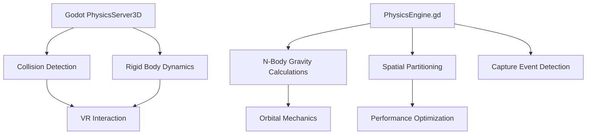
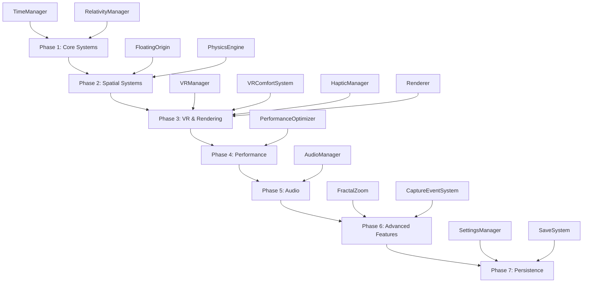
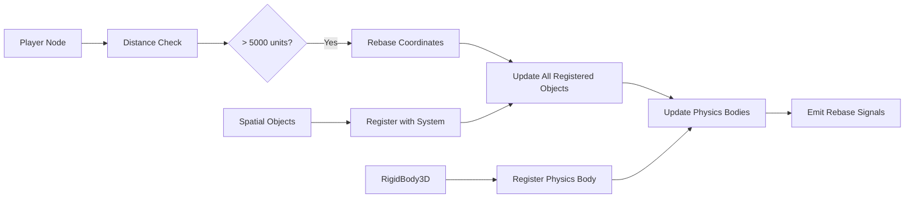
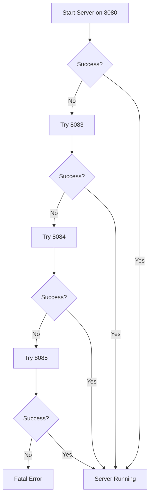
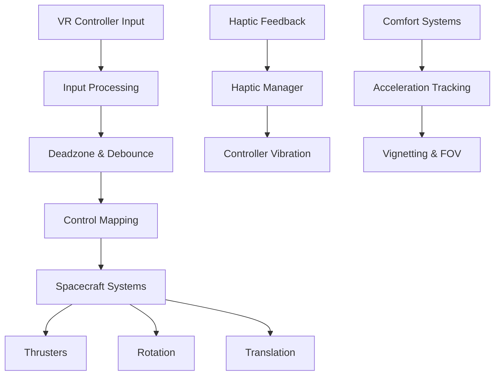
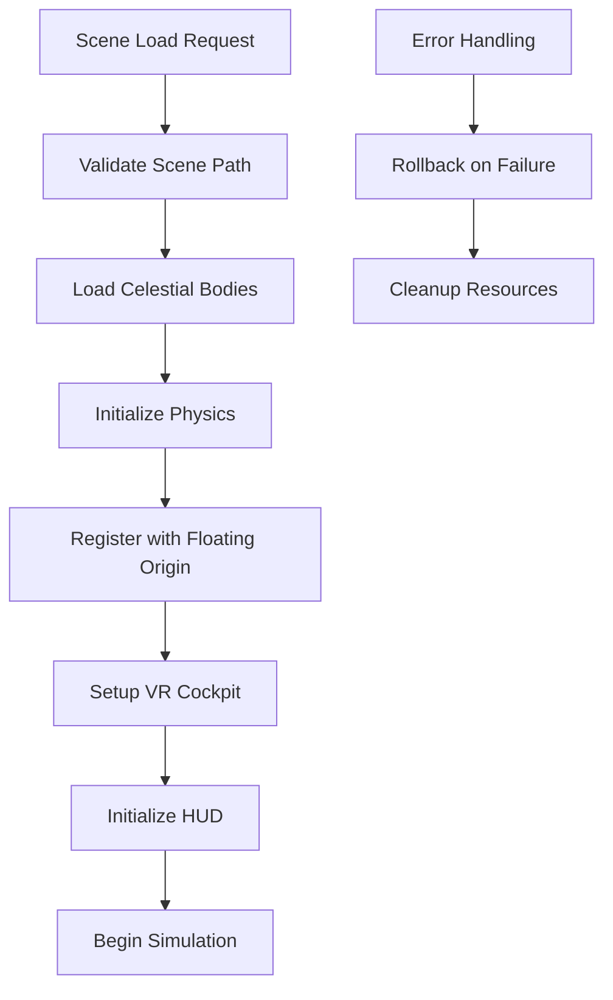
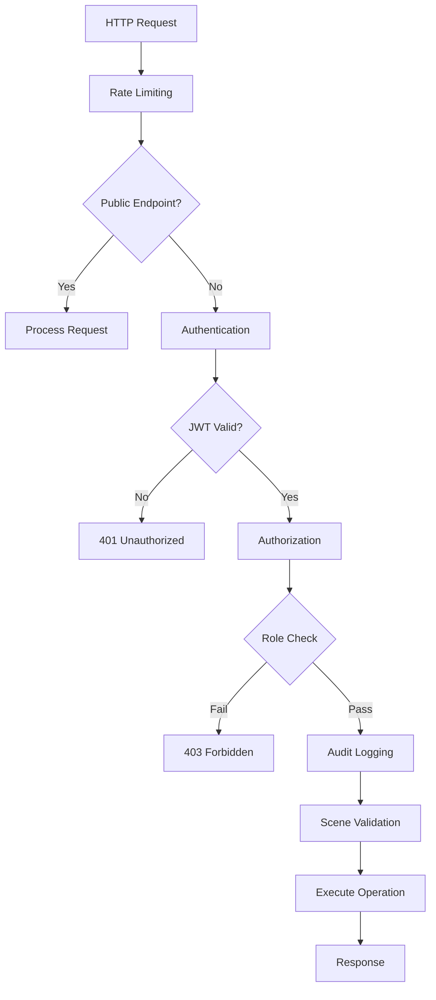
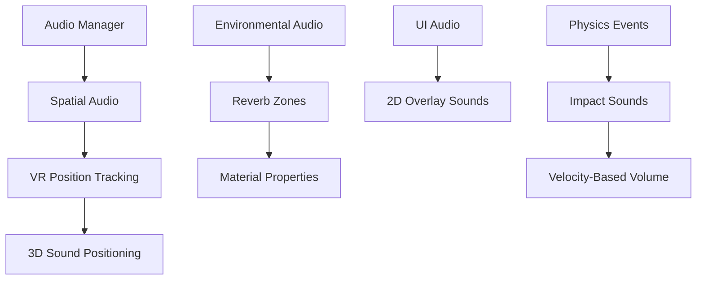
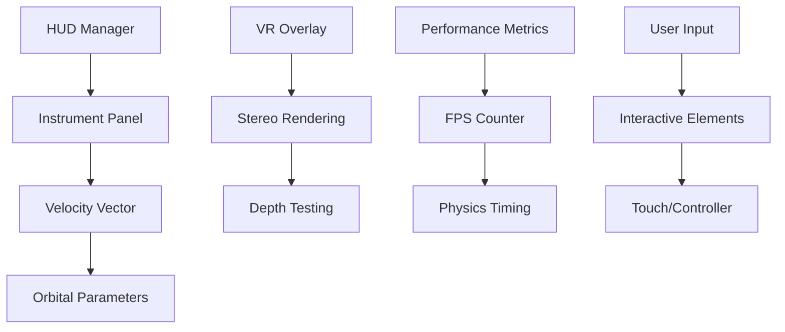

# Project Resonance - Architecture Documentation

## Executive Summary

Project Resonance is a Godot 4.5+ VR space simulation featuring realistic orbital mechanics, astronomical-scale distances, and comprehensive HTTP API integration. This document provides a unified architectural vision addressing previous misconceptions (particularly around physics engine choices) and establishing clear patterns for development.

**Key Architectural Decision**: The project uses **Godot's built-in PhysicsServer3D** with custom N-body gravity calculations, NOT a Python physics engine. This decision is based on performance, VR requirements, and Godot's architecture.

## Table of Contents

1. [Physics Engine Architecture](#physics-engine-architecture)
2. [Core Engine Patterns](#core-engine-patterns)
3. [Subsystem Architecture](#subsystem-architecture)
4. [Non-Obvious Conventions](#non-obvious-conventions)
5. [Implementation Guidelines](#implementation-guidelines)
6. [Architecture Decision Records](#architecture-decision-records)

## Physics Engine Architecture

### The Python Physics Misconception

**Previous Suggestion**: "Physics engine in Python"  
**Actual Implementation**: Godot PhysicsServer3D with GDScript N-body gravity

**Why Python Physics is Problematic**:

1. **Performance**: Python's GIL and interpreter overhead cannot maintain 90 FPS VR requirements
2. **Integration**: Godot's physics pipeline is tightly coupled with rendering and VR tracking
3. **Threading**: Godot's physics runs on separate threads; Python integration would cause sync issues
4. **VR Requirements**: 11ms frame budget leaves no room for cross-language marshalling overhead
5. **Floating Origin**: Coordinate rebasing must be synchronized with physics state

### Actual Physics Architecture



**Components**:

- **PhysicsServer3D**: Godot's native physics engine for collision detection and rigid body dynamics
- **PhysicsEngine.gd**: Custom GDScript system for N-body gravitational calculations
- **Spatial Partitioning**: Grid-based optimization reducing O(n²) to O(n log n) complexity
- **Capture Events**: Detection of when spacecraft enter gravitational capture zones

**Key Files**:
- [`scripts/core/physics_engine.gd`](scripts/core/physics_engine.gd:1) - N-body gravity implementation
- [`project.godot`](project.godot:45) - Physics configuration (90 FPS, zero gravity)

## Core Engine Patterns

### 7-Phase Initialization Sequence

The [`ResonanceEngine`](scripts/core/engine.gd:76) coordinates all subsystems through a strict dependency chain:



**Critical Dependencies**:
- Physics depends on Floating Origin (coordinate rebasing before physics updates)
- VR systems depend on Physics (motion sickness prevention)
- Audio depends on VR (spatial audio positioning)
- Performance depends on Renderer (LOD management)

### Floating Origin System

**Purpose**: Prevent floating-point precision errors at astronomical distances

**Architecture**:


**Key Mechanisms**:
- **Threshold**: 5000 units from origin triggers rebasing
- **Atomic Operation**: Complete rebasing within single frame
- **Physics Sync**: Direct PhysicsServer3D state updates
- **Global Offset Tracking**: Cumulative offset for save/load operations

**Registration Requirements**:
```gdscript
# All spatial objects MUST register before physics processing
ResonanceEngine.register_with_floating_origin(my_object)

# Physics bodies get special handling
floating_origin.register_physics_body(my_rigid_body)
```

### Port Fallback Chain

**HTTP API Port Strategy**: 8080 → 8083 → 8084 → 8085



**Implementation**: Automatic fallback in [`http_api_server.gd`](scripts/http_api/http_api_server.gd:96)

### Circuit Breaker Pattern

**Purpose**: Prevent cascading failures in DAP/LSP connections

**States**:
- **CLOSED**: Normal operation
- **OPEN**: Connection failed, blocking requests
- **HALF_OPEN**: Testing if service recovered

**Implementation**: ConnectionManager with failure counting and timeout recovery

### Binary Telemetry Protocol

**Custom Protocol** for performance-critical FPS data:

```
Packet Structure:
[0x01][timestamp][fps_value][checksum]

Type 0x01: FPS data
Type 0x02: Memory usage
Type 0x03: Physics timing
```

**Compression**: GZIP for JSON payloads > 1KB

**Multi-Client**: Broadcast to all connected debug clients simultaneously

## Subsystem Architecture

### VR Cockpit Controls System



**Components**:
- **Input Processing**: Raw controller input with deadzone compensation
- **Control Mapping**: Abstract control surfaces from physical inputs
- **Haptic Manager**: Controller vibration patterns
- **Comfort System**: Motion sickness prevention via vignetting

**Key Files**:
- [`scripts/player/vr_cockpit_controls.gd`](scripts/player/vr_cockpit_controls.gd:1)
- [`scripts/core/haptic_manager.gd`](scripts/core/haptic_manager.gd:1)
- [`scripts/core/vr_comfort_system.gd`](scripts/core/vr_comfort_system.gd:1)

### Solar System Initialization Coordinator

**Purpose**: Orchestrate complex multi-phase solar system loading



**Phases**:
1. **Validation**: Scene whitelist and path security
2. **Loading**: Async celestial body instantiation
3. **Physics**: N-body gravity setup
4. **Registration**: Floating origin and spatial systems
5. **VR**: Cockpit and controller initialization
6. **HUD**: Instrument panel setup
7. **Simulation**: Physics and time systems start

### HTTP API Security Layer



**Security Features**:
- **JWT Authentication**: Token-based auth with expiration
- **Rate Limiting**: Token bucket algorithm per IP
- **Role-Based Access Control**: Admin, user, auditor roles
- **Audit Logging**: All operations logged with context
- **Scene Whitelist**: Path traversal prevention
- **Request Size Limits**: 1MB maximum payload

**Key Files**:
- [`scripts/http_api/security_config.gd`](scripts/http_api/security_config.gd:1)
- [`scripts/http_api/http_api_server.gd`](scripts/http_api/http_api_server.gd:1)

### Audio System Integration



**VR Audio Requirements**:
- **Spatial Positioning**: Update every frame with VR tracking
- **Distance Attenuation**: Realistic falloff for space environments
- **Doppler Effect**: Relative velocity calculations
- **Reverb Zones**: Different acoustic properties per environment

### HUD Rendering Pipeline



**VR HUD Challenges**:
- **Stereo Rendering**: Separate renders for each eye
- **Depth Perception**: Proper Z-ordering in 3D space
- **Performance**: Minimal draw calls to maintain 90 FPS
- **Readability**: High contrast for various backgrounds

## Non-Obvious Conventions

### Requirements Traceability

**Every script MUST reference `.kiro/specs/` requirements**:

```gdscript
## Requirements: 1.4, 7.1, 7.2, 7.3, 7.4, 7.5, 9.1, 9.2, 9.3, 9.4, 9.5
## - 1.4: Use Godot Physics for collision detection
## - 9.1: Calculate gravitational force using Newton's law
## - 9.2: Apply force vector to spacecraft velocity
```

**Validation**: Automated checks ensure all scripts have requirement references

### GDUnit4 Manual Installation

**Not Optional**: GDUnit4 must be manually installed via Asset Library

**Why**: Automated installation causes version conflicts and plugin loading issues

**Installation**:
1. Open Asset Library in Godot
2. Search for "GDUnit4"
3. Install and enable plugin
4. Restart editor

### Zero Gravity Override

**Critical**: [`project.godot`](project.godot:46) sets `3d/default_gravity=0.0`

**Rationale**: 
- Space simulation requires custom gravity calculations
- Prevents Godot's default -9.8 m/s² from interfering
- N-body gravity replaces default gravity

**Script Requirements**:
```gdscript
# NEVER change gravity in scripts
# Use PhysicsEngine for all gravity calculations
ResonanceEngine.physics_engine.add_celestial_body(planet, mass, radius)
```

### Multi-Client Telemetry Broadcasting

**Architecture**: UDP multicast to all connected debug clients

**Protocol**: Custom binary protocol for performance

**Use Cases**:
- Multiple developers debugging simultaneously
- Automated testing with telemetry capture
- Performance monitoring dashboards

### Service Discovery

**UDP Broadcast**: Port 8087 announces available services

**Format**:
```json
{
  "service": "godot_debug",
  "port": 8080,
  "version": "2.5",
  "capabilities": ["http_api", "telemetry", "scene_management"]
}
```

**Auto-Discovery**: Tools can automatically find and connect to running instances

## Implementation Guidelines

### When to Use Godot Physics vs Custom Solutions

**Use Godot PhysicsServer3D for**:
- Collision detection and response
- Rigid body dynamics (mass, velocity, forces)
- Raycasting and shape queries
- Physics material interactions

**Use Custom PhysicsEngine.gd for**:
- N-body gravitational calculations
- Orbital mechanics
- Capture event detection
- Custom force fields

**Never Use Python for**:
- Real-time physics calculations
- VR-critical code paths
- Anything requiring < 11ms execution time

### Performance Optimization Strategies for VR

**Frame Budget**: 11ms per frame (90 FPS target)

**Optimization Hierarchy**:
1. **Algorithmic**: O(n²) → O(n log n) via spatial partitioning
2. **Data-Oriented**: Cache-friendly data structures
3. **Parallel**: Godot's thread pools for independent calculations
4. **GPU**: Compute shaders for massive parallelism
5. **Approximation**: LOD systems for distant objects

**VR-Specific Optimizations**:
- **Foveated Rendering**: Higher resolution at center of vision
- **Asynchronous Timewarp**: Reprojection to maintain frame rate
- **Motion Smoothing**: Interpolation for dropped frames
- **Dynamic LOD**: Adjust detail based on distance and performance

### Testing Approach for Different Subsystems

**Unit Tests** (GDUnit4):
- Individual function behavior
- Edge cases and error handling
- Requirement verification

**Property Tests** (Python Hypothesis):
- Mathematical properties (gravity, orbital mechanics)
- Fuzzing for security vulnerabilities
- Performance regression detection

**Integration Tests**:
- Subsystem interaction (Physics + Floating Origin)
- HTTP API endpoint testing
- VR controller input pipelines

**Performance Tests**:
- Frame time analysis
- Memory usage profiling
- Physics calculation timing

### Security Considerations for HTTP API

**Defense in Depth**:
1. **Network**: Localhost binding only (127.0.0.1)
2. **Transport**: TLS encryption for production
3. **Authentication**: JWT with rotation
4. **Authorization**: Role-based access control
5. **Input Validation**: Strict type checking and size limits
6. **Audit Logging**: All operations logged immutably

**Security Headers**:
```http
X-Content-Type-Options: nosniff
X-Frame-Options: DENY
X-XSS-Protection: 1; mode=block
Strict-Transport-Security: max-age=31536000
```

## Architecture Decision Records

### ADR-001: Godot Physics vs Python Physics Engine

**Status**: Accepted  
**Date**: 2025-12-09

**Context**: Previous architecture suggestions recommended implementing physics engine in Python for flexibility and mathematical precision.

**Decision**: Use Godot's built-in PhysicsServer3D with GDScript N-body gravity calculations.

**Rationale**:
- **Performance**: Python cannot maintain 90 FPS VR requirements due to GIL and interpreter overhead
- **Integration**: Godot's physics pipeline is tightly coupled with rendering and VR tracking
- **Threading**: Godot's physics runs on separate threads; Python integration would cause synchronization issues
- **VR Requirements**: 11ms frame budget leaves no room for cross-language marshalling overhead
- **Floating Origin**: Coordinate rebasing must be synchronized with physics state

**Consequences**:
- ✅ Maintain 90 FPS performance target
- ✅ Seamless integration with Godot's rendering pipeline
- ✅ Proper VR motion-to-photon latency
- ❌ Less flexibility for custom physics algorithms
- ❌ GDScript performance limitations for complex math

**Mitigation**: Use spatial partitioning and algorithmic optimization to maintain performance within GDScript constraints.

### ADR-002: Floating Origin Coordinate System

**Status**: Accepted  
**Date**: 2025-12-09

**Context**: Simulating solar system scales requires handling distances from meters to astronomical units while maintaining floating-point precision.

**Decision**: Implement floating origin system with coordinate rebasing at 5000 unit threshold.

**Rationale**:
- **Precision**: 32-bit floats lose precision beyond ~10,000 units
- **Performance**: Local coordinates enable physics optimizations
- **Compatibility**: Works with Godot's physics engine
- **Save/Load**: Global offset tracking enables persistent universe state

**Consequences**:
- ✅ Maintain precision across solar system scales
- ✅ Compatible with Godot PhysicsServer3D
- ✅ Enable persistent universe state
- ❌ Complexity in coordinate conversions
- ❌ All spatial objects must register with system

**Mitigation**: Provide helper functions for coordinate conversion and automated registration for common object types.

### ADR-003: JWT-Based API Authentication

**Status**: Accepted  
**Date**: 2025-12-09

**Context**: HTTP API requires secure authentication for remote scene management and control.

**Decision**: Use JWT tokens with role-based access control instead of simple API keys.

**Rationale**:
- **Security**: Cryptographically signed tokens prevent tampering
- **Expiration**: Time-limited tokens reduce attack window
- **Roles**: Fine-grained access control for different operations
- **Standards**: JWT is industry standard with wide library support
- **Audit**: Token claims enable detailed audit logging

**Consequences**:
- ✅ Strong security with token expiration
- ✅ Role-based access control
- ✅ Industry standard compatibility
- ❌ Token management complexity
- ❌ Clock synchronization requirements

**Mitigation**: Implement token rotation and provide management utilities.

### ADR-004: 90 FPS Physics-VR Coupling

**Status**: Accepted  
**Date**: 2025-12-09

**Context**: VR requires consistent frame rates to prevent motion sickness.

**Decision**: Hardcode physics tick rate to 90 FPS matching VR refresh rate.

**Rationale**:
- **Motion Sickness**: Mismatched physics and rendering rates cause discomfort
- **Predictability**: Fixed timestep enables stable physics simulation
- **Performance**: Known frame budget enables optimization
- **VR Standards**: 90 FPS is standard for PC VR headsets

**Consequences**:
- ✅ Consistent VR experience
- ✅ Stable physics simulation
- ✅ Clear performance targets
- ❌ Inflexible for different hardware
- ❌ Performance pressure on all systems

**Mitigation**: Provide quality settings for lower-end hardware with reprojection.

## Future Extension Points

### Modular Physics System

**Design**: Plugin architecture for custom force calculations

**Extension Points**:
- Custom gravity fields
- Atmospheric drag models
- Solar radiation pressure
- Magnetic field interactions

### Distributed Simulation

**Design**: Multi-server architecture for massive scale

**Components**:
- **Physics Workers**: Dedicated servers for N-body calculations
- **Spatial Partitioning**: Octree-based universe segmentation
- **Interest Management**: Only simulate nearby regions per player
- **State Synchronization**: Efficient delta compression

### Advanced Rendering Pipeline

**Design**: Custom render pipeline for space visualization

**Features**:
- **Procedural Planets**: GPU-generated surface detail
- **Atmospheric Scattering**: Realistic planetary atmospheres
- **Volumetric Clouds**: 3D cloud simulation
- **Relativistic Effects**: Visual effects for near-light speeds

## Conclusion

This architecture provides a solid foundation for Project Resonance, addressing previous misconceptions while establishing clear patterns for development. The key insight is leveraging Godot's built-in systems where appropriate while extending them with custom solutions for space simulation-specific requirements.

**Next Steps**:
1. Review architecture with development team
2. Create detailed implementation plans for each subsystem
3. Establish performance benchmarks and monitoring
4. Begin phased implementation with continuous validation

---

**Document Version**: 1.0  
**Last Updated**: 2025-12-09  
**Maintained By**: Architecture Team